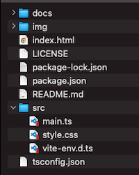

# heatmap-example


Start MapLibre GL JS easily.  
- [MapLibre GL JS v4.0.0](https://maplibre.org)  
- [TypeScript v5.3.3](https://www.typescriptlang.org)  
- [Vite v5.1.1](https://vitejs.dev)  
- node v21.6.0
- npm v10.2.4

<br>

## Usage



<br>

Install package
```bash
npm install
```

<br>

build
```bash
npm run build
```

<br>

dev
```bash
npm run dev
```